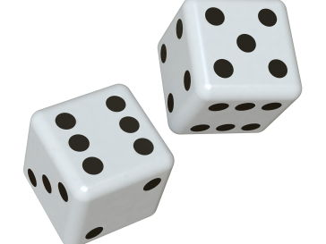
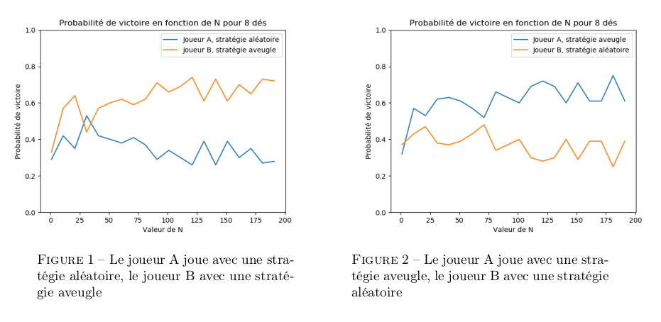
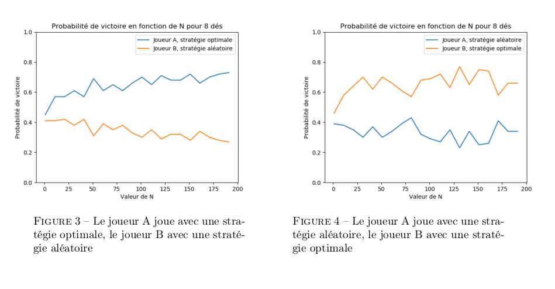
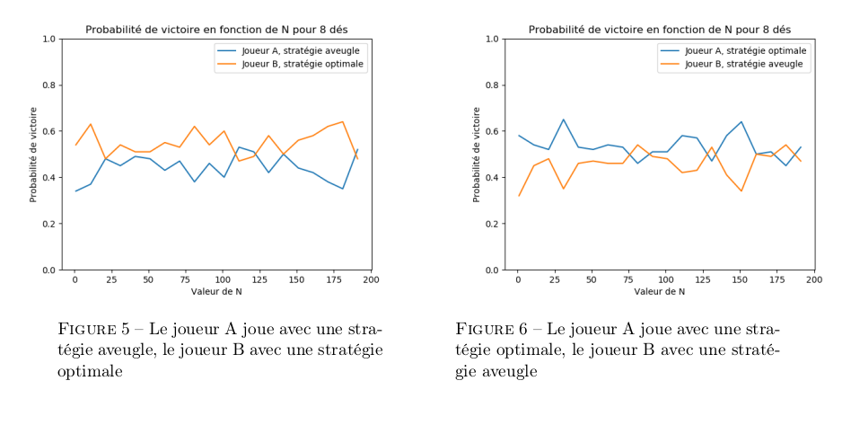
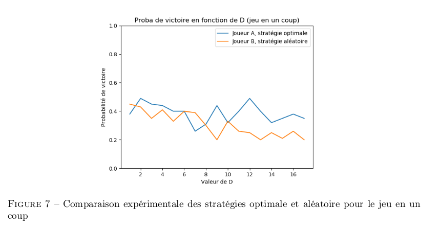

# Dice-Battle

Deux joueurs s'afrontent dans un jeu de dés. Le but est d'être le premier à atteindre au moins N points (généralement N = 100). A chaque tour, on choisit de lancer entre 1 et D dés à six faces (par exemple, D = 10). Le nombre de points marqués est 1 si l'un des dés au moins tombe sur 1, dans le cas contraire c'est la somme des dés. Nous allons étudier deux variantes de ce jeu :

  

**Chacun des deux joueurs suit une stratégie de jeux dans la suite on va faire une compagne d'éxpériances sur les stratéfies possibles (aveugle, aléaroire, optimale) selon la version du jeux**

**Pour plus de détails sur le calcul des probabilité de vectoire et les stratégies suivi, veuillez vous reférez au rapport : rapport_pl.pdf**

### variante séquentielle :  
 les joueurs jouent à tour de rôle (le premier joueur a donc bien sûr un avantage)

* Les figures 1 et 2 montrent que la stratégie aléatoire est dominée par la stratégie aveugle
indépendamment de l’ordre des joueurs, ce qui est cohérent car la stratégie aveugle est la stratégie maximisant l’espérance du nombre de points.

Voici les courbes des probabilites de vectoires en fonction de N selon la stratégie suivi (aleatroire ou aveugle) 

  

* De même, les figures 3 et 4 montrent que la stratégie aléatoire est toujours dominée par la
stratégie optimale, peu importe l’ordre des joueurs.

  

* Cependant, les figures 5 et 6 montrent que la stratégie optimale est légèrement meilleure que
la stratégie aveugle, ce qui est cohérent. Le ratio est d’environ 60% de victoires pour la stratégie optimale contre 40% pour la stratégie aveugle.

  

On remarque que dans toutes les figures citées précedemment, nous avons uniquement fait varier
N : Lorsque D varie, les résultats obtenus sont similaires.

### variante simultanée : 

les joueurs jouent simultanément à chaque tour. Dans ce cas si les deux joueurs atteignent N points ou plus lors du même tour, c'est le joueur qui dépasse le plus les N points qui l'emporte ; si les deux joueurs obtiennent le même score, alors ils sont
ex-aequos.

Le but du projet est de déterminer une stratégie de jeu optimale (et de tester cette stratégie par rapport à d'autres). 

On dit qu'un joueur a un gain égal à 1 s'il remporte la partie, un gain égalà 0 si la partie est nulle, un gain égal à -1 s'il perd. C'est donc en particulier un jeu à somme nulle.

La figure 7 montre que la stratégie optimale est meilleure que la stratégie aléatoire pour le
jeu en un coup.

  

## Notions abordées : 

* Calcul de probabilité
* Programation dynamique
* Résolution d'un probleme d'optimisation.
